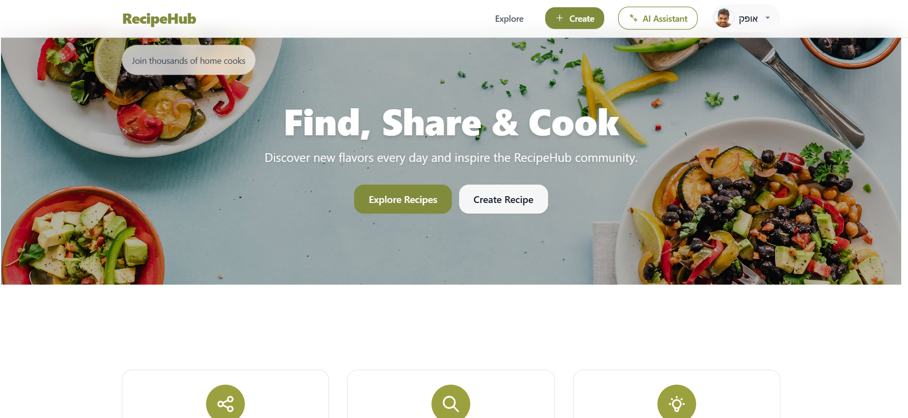
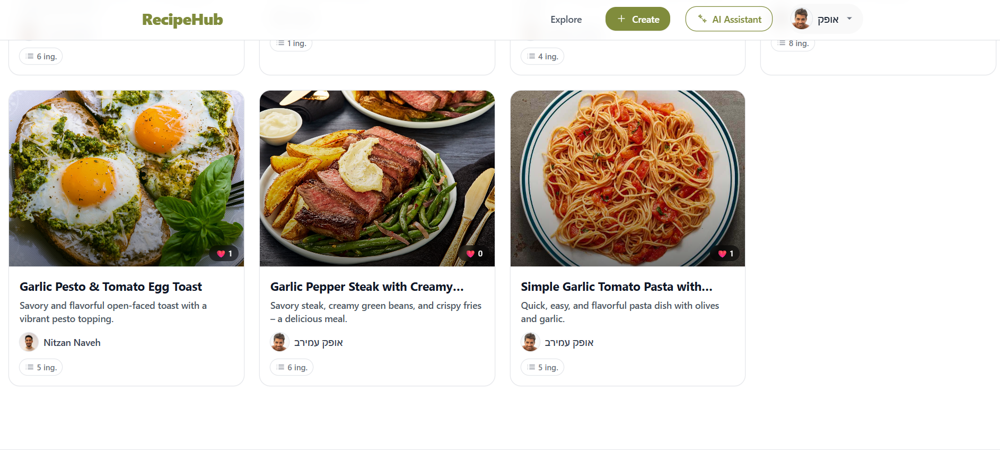
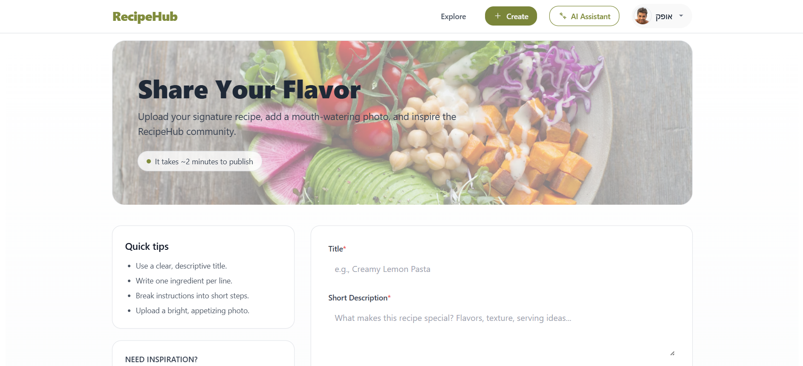
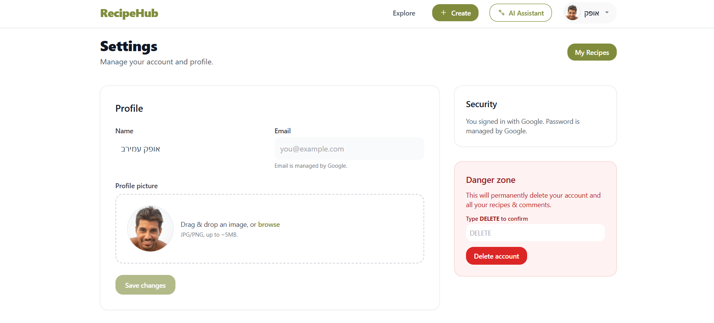
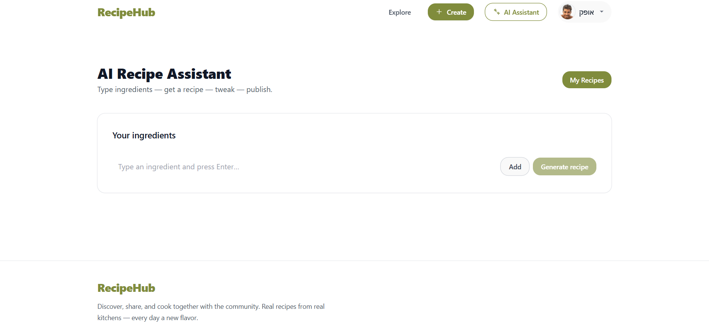

# 🍳 RecipeHub

**RecipeHub** is a social web application for sharing and discovering recipes.  
It includes a modern **React + Vite + Tailwind** frontend and a **Node.js/Express + MongoDB** backend with user authentication (JWT + Google OAuth) and full API documentation with Swagger.


## 🚀 Tech Stack

### Backend
- **Node.js + Express**
- **MongoDB + Mongoose**
- **JWT Authentication**
- **Google OAuth (Passport)**
- **Swagger** (API documentation)
- **Jest + Supertest** (unit & integration tests)
- **TypeScript + ESLint**

### Frontend
- **React + TypeScript**
- **Vite** (build tool)
- **Tailwind CSS** (modern styling)
- **React Router v7**
- **Zustand** (state management)
- **Axios** (API requests)
- **Lottie** (animations)
- **React Hook Form** (form handling)
- **Google OAuth (react-oauth/google)**


## 📂 Project Structure

```
RecipeHub/
│── server/             # Backend
│ ├── src/
│ │ ├── controllers/    # Request logic
│ │ ├── models/         # Database models (Mongoose)
│ │ ├── routes/         # API routes
│ │ ├── tests/          # Jest tests
│ │ ├── types/          # Type definitions
│ │ ├── app.ts          # App configuration
│ │ └── server.ts       # Entry point
│ ├── package.json
│ └── tsconfig.json
│
│── client/             # Frontend
│ ├── public/           # Static files
│ ├── src/
│ │ ├── api/            # API calls
│ │ ├── assets/         # Images/icons
│ │ ├── components/     # UI components
│ │ ├── interfaces/     # TypeScript interfaces
│ │ ├── pages/          # Application pages
│ │ ├── store/          # Zustand store
│ │ └── utils/          # Utility functions
│ ├── package.json
│ └── tsconfig.json

```


## ⚙️ Setup & Installation

### Prerequisites
- Node.js
- MongoDB (local or Atlas)
- Storage Folder in Backend for image uploads 
- Google OAuth Client ID

### Backend Setup
```bash
cd server
npm install
npm run start
```
Server runs on: http://localhost:4000

### Frontend Setup
```bash 
cd client
npm run build
npm run dev
```
Client runs on: http://localhost:5173


### 🔑 Environment Variables

Create a `.env`, `.envdev`, `.envprod` files inside the server folder:

```bash
PORT= 4000
DB_CONNECTION=
ACCESS_TOKEN_SECRET=
REFRESH_TOKEN_SECRET=
TOKEN_EXPIRATION= 15m
REFRESH_TOKEN_EXPIRATION= 7d
SERVER_URL=http://localhost:4000
CLIENT_URL=http://localhost:5173
GOOGLE_CLIENT_ID=
GOOGLE_CLIENT_SECRET=
GEMINI_API_KEY=
DOMAIN_BASE=http://localhost:4000
STORAGE_DIR=storage

```

### 🧪 Running Tests
```bash
# Run all tests
npm test

# Run specific test suites
npm run testUser
npm run testRecipe
npm run testComment
npm run testAuth
```

### 📖 API Documentation

Once the server is running, Swagger docs are available at:
 http://localhost:4000/api-docs

### ✨ Features

- 📌 Create and share recipes with images

- 📝 Add comments on recipes

- 🔎 Search recipes

- 👤 User management (JWT + Google OAuth)

- ✨ Generate recipes with AI

📚 Swagger API documentation

## 📸 Screenshots

### Home Page


### Explore Recipes 


### Add Recipe


### User Profile


### AI Generate


### 📜 License

This project is licensed under the `MIT` License.

### 👨‍💻 Author

Ofek Amirav - 2025
